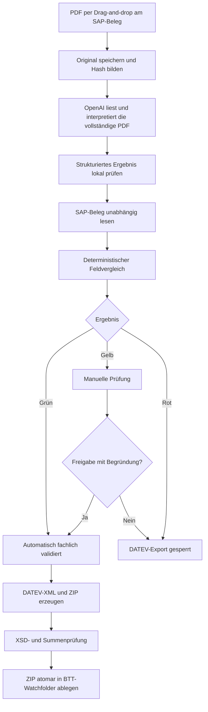

# KI-Validierungs- und Freigabekonzept für Rechnungsbelege

## Problem

Die technische SAP-Verknüpfung über `DocEntry` und `AttachmentEntry` beweist, **welche Datei an welchem SAP-Beleg hängt**. Sie beweist nicht, dass die Datei inhaltlich die richtige Rechnung ist.

Im bisherigen Ablauf kann ein falsches PDF angehängt werden. Der Dienst ergänzt dieses PDF anschließend trotzdem mit den Buchungsdaten aus SAP und erzeugt daraus ein DATEV-Paket. Dadurch wirkt ein falscher Beleg technisch vollständig, obwohl PDF und SAP-Buchung fachlich nicht zusammengehören.

Das neue System darf SAP-Daten deshalb niemals als Beweis für den PDF-Inhalt verwenden. Es muss zwei voneinander unabhängige Datenquellen bilden und erst danach vergleichen:

1. **SAP-Snapshot** – die tatsächlich gebuchte Ein- oder Ausgangsrechnung;
2. **Dokument-Snapshot** – ausschließlich aus PDF, XRechnung oder ZUGFeRD extrahierte Werte.

## Verbindlicher Prozess

## Extraktion aus dem Dokument

OpenAI erhält die Original-PDF direkt als Dateieingang und verarbeitet den eingebetteten Text sowie die sichtbaren Seitenbilder gemeinsam. Die Antwort ist durch ein striktes JSON-Schema begrenzt und liefert für jedes Feld:

- normalisierten Wert;
- Originaltext;
- vollständige sichtbare Transkription;
- Unsicherheits- und Konfliktkennzeichen.

Zu extrahieren sind mindestens:

- Dokumentart: Rechnung, Gutschrift, Mahnung, Lieferschein, Packliste usw.;
- Rechnungsnummer;
- Rechnungssteller und Rechnungsempfänger;
- USt-IdNr. bzw. Steuernummer, soweit vorhanden;
- Rechnungsdatum und Leistungsdatum;
- Netto-, Steuer- und Bruttobetrag;
- Währung;
- Steuersätze und Steuerbeträge;
- IBAN, soweit vorhanden;
- Positionssummen oder zumindest Summenblöcke.

Es gibt keinen lokalen Windows-OCR- oder Regex-Feldparser als zweiten Interpretationsweg. Fehlende oder unsichere Werte werden nicht geraten, sondern führen zur sichtbaren manuellen Prüfung. SAP-Sollwerte werden nicht an OpenAI gesendet; die Extraktion bleibt unabhängig. Erst NovaNein prüft das schemafeste Ergebnis lokal und führt den deterministischen SAP-Vergleich aus.

## Vergleichsregeln für Eingangsrechnungen

### Harte Sperren

Folgende Fälle dürfen nie automatisch zu DATEV gelangen:

- Dokument ist keine Rechnung bzw. passende Gutschrift;
- Rechnungsnummer fehlt oder widerspricht `OPCH.NumAtCard`;
- Lieferant widerspricht SAP-Geschäftspartner;
- Example Company ist nicht plausibel als Rechnungsempfänger erkennbar;
- Bruttobetrag oder Währung widersprechen SAP;
- Gutschrift wurde in SAP als Rechnung oder umgekehrt gebucht;
- PDF-Hash ist bereits einem anderen SAP-Beleg zugeordnet;
- PDF ist defekt, kennwortgeschützt oder durch OpenAI nicht ausreichend sicher lesbar;
- Steuer- oder Summenabweichung überschreitet die konfigurierte Toleranz.

### Vergleichsfelder

| PDF-/E-Rechnungsfeld | SAP-Feld bzw. SAP-Quelle | Bewertung |
| --- | --- | --- |
| Rechnungsnummer | `OPCH.NumAtCard` | normalisiert exakt; OCR-Verwechslungen nur als Review-Hinweis |
| Lieferant | `OPCH.CardCode/CardName`, `OCRD`, USt-IdNr. | USt-IdNr. oder eindeutiger Stammdatentreffer bevorzugt |
| Rechnungsdatum | `OPCH.TaxDate/DocDate` | exakt oder konfigurierte Review-Toleranz |
| Bruttobetrag | `OPCH.DocTotal/DocTotalFC` | gleiche Währung, centgenau bzw. definierte Rundung |
| Steuerbetrag | `OPCH.VatSum/VatSumFC` | centgenau bzw. definierte Rundung |
| Währung | `OPCH.DocCur` | exakt |
| Steuersätze | `PCH1.VatGroup/VatPrcnt`, `AVT1` | fachlich kompatibel; BU-Code wird nur aus SAP abgeleitet |
| Dokumentart | SAP-Objektart | Rechnung/Gutschrift muss übereinstimmen |

Ein unscharfer Lieferantenname allein reicht nicht für eine automatische Freigabe. USt-IdNr., Kreditor, Rechnungsnummer, Betrag und Währung bilden zusammen den belastbaren Identitätsnachweis.

## Vergleichsregeln für Ausgangsrechnungen

Bei Ausgangsrechnungen wird das PDF aus dem freigegebenen SAP-Layout erzeugt. Trotzdem erfolgt ein Readback:

- Rechnungsnummer gegen `OINV.DocNum`;
- Kunde gegen `OINV.CardCode/CardName`;
- Example Company als Rechnungssteller;
- Datum, Währung, Netto, Steuer und Brutto;
- PDF-Hash und verwendete Layoutversion.

Der automatische Export ist nur zulässig, wenn das erzeugte PDF denselben SAP-Stand wiedergibt, der für das DATEV-Paket verwendet wird.

## Ampel und Statusmodell

### Grün – `VALIDATED`

- Dokumentart stimmt;
- alle harten Identitätsfelder stimmen;
- keine Dublette;
- ausreichende Extraktionsqualität;
- Summen- und Steuerprüfung erfolgreich.

Nur dieser Status darf automatisch die DATEV-Paketbildung starten.

### Gelb – `MANUAL_REVIEW`

Beispiele:

- OpenAI kennzeichnet wichtige Belegfelder als unsicher;
- Lieferantenname abweichend, aber USt-IdNr. passend;
- Rechnungsdatum innerhalb freigegebener Toleranz;
- Rechnungsnummer enthält einen plausiblen Zeichenlesefehler;
- Positionsabgleich nicht möglich, Kopf- und Summendaten aber plausibel.

Eine Freigabe benötigt Benutzer, Zeitpunkt, Begründung und sichtbare Gegenüberstellung der Werte.

### Rot – `MISMATCH_BLOCKED`

Harte Abweichung oder falscher Dokumenttyp. Es wird kein DATEV-ZIP erzeugt. Ein Austausch des PDFs erzeugt einen neuen Dokument-Snapshot; das falsche Original und die Entscheidung bleiben im Audit erhalten.

## Floating SAP UI

Das kleine schwebende Fenster bleibt bewusst erhalten, weil der heutige Arbeitsablauf effizient ist.

Das Fenster zeigt für den aktuell geöffneten SAP-Beleg:

- SAP-Belegart, `DocEntry`, Belegnummer und Geschäftspartner;
- Drag-and-drop-Fläche und PDF-Vorschau;
- extrahierte Rechnungswerte;
- Gegenüberstellung PDF ↔ SAP;
- grüne, gelbe oder rote Abweichungsanzeige;
- Status von SAP-Anhang, Validierung, DATEV-Paket und Belegtransfer;
- Schaltfläche für Austausch oder begründete manuelle Freigabe.

Das UI enthält keine DATEV- oder Matching-Kernlogik. Es übergibt den aktuellen SAP-Kontext an den internen Dienst und zeigt dessen Ergebnis.

## Interne Datenhaltung

Die Eigenlösung läuft vollständig im Haus.

Empfohlener Aufbau:

- **SQLite** auf dem lokalen Backend-Server für Dokumentmetadaten, SAP-Snapshots, Extraktionen, Vergleichsergebnisse, Freigaben, DATEV-Pakete, Transferstatus und Audit-Ereignisse;
- Originaldateien in einem ausschließlich intern erreichbaren, vom Backend verwalteten Dateispeicher;
- SHA-256, Dateigröße und MIME-Typ in SQL;
- keine nachträgliche Änderung eines gespeicherten Originals;
- getrennte Tabellen/Objekte für Original, Ableitung, SAP-Snapshot und DATEV-Paket.

Eine einzelne veränderbare PDF-Spalte ohne Versionierung und Audit reicht nicht aus.

## DATEV-Grenze

Die Eigenlösung deckt alles ab bis einschließlich:

- Belegaufnahme;
- SAP-Verknüpfung;
- KI-/OCR-Extraktion;
- fachlicher Abgleich;
- Freigabe;
- DATEV-XML;
- XSD-Validierung;
- ZIP-Erzeugung;
- sichere, atomare Ablage im konfigurierten Watchfolder;
- Überwachung von Abholung, Archiv und BTTnext-Protokollen.

**DATEV Belegtransfer bleibt installiert.** Er überwacht den Watchfolder und führt den eigentlichen Upload zu DATEV aus.

Das ZIP wird zunächst in einem Arbeitsverzeichnis vollständig erzeugt und geprüft. Erst danach wird es atomar in den Watchfolder verschoben. Lose XML-, CSV-, TXT- oder temporäre Dateien dürfen dort niemals erscheinen.

## Produktregel

> SAP liefert Buchungsdaten. Das Dokument liefert Beleginhalte. Erst der belegte Vergleich beider unabhängigen Quellen erlaubt die DATEV-Übertragung.
